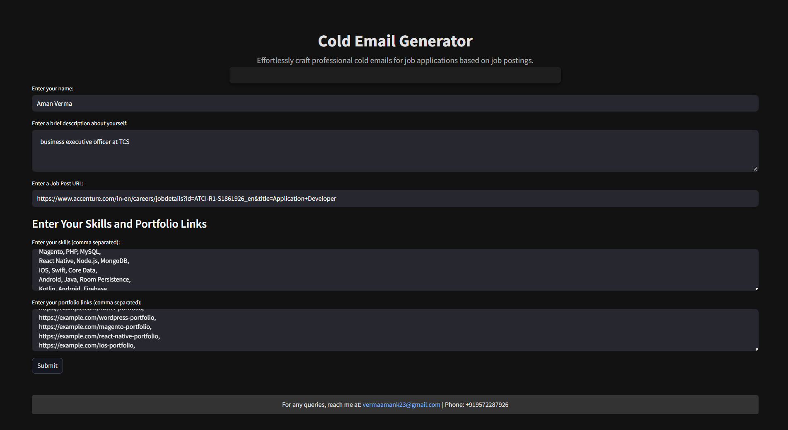
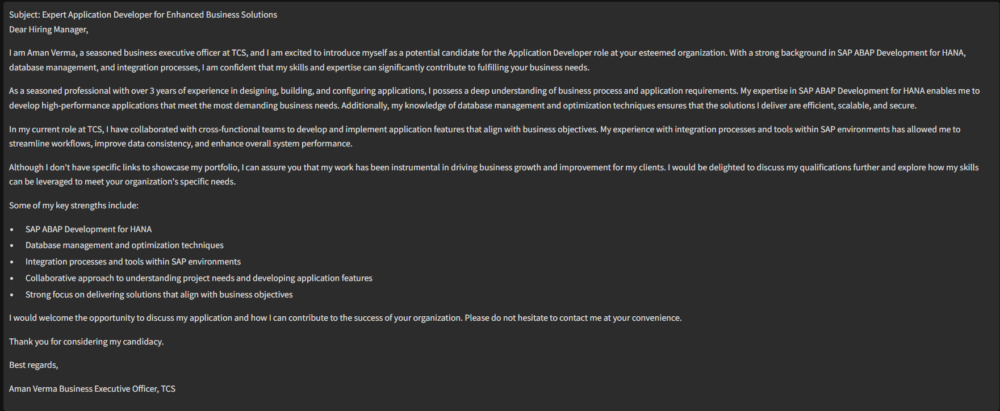

# 📧 Cold Mail Generator
This is an AI-powered cold email generator built for service-based companies looking to reach out to potential clients based on their job listings.
It uses LangChain, GROQ, Streamlit, and a vector database to extract job roles from company careers pages and automatically generate personalized cold emails with relevant portfolio links.

**Imagine a scenario:**

Tesla is actively expanding its autonomy team and is hiring for the role of Senior AI/ML Engineer. Rather than going through a lengthy hiring process, ByteForge, an AI consultancy, sees an opportunity to step in.

Priya, a business development executive at ByteForge, uses the Cold Email Generator to craft a highly personalized outreach email to Tesla. The tool analyzes the job description from Tesla's careers page and automatically suggests relevant portfolio projects where ByteForge has successfully deployed transformer-based models for automotive applications.

This allows Priya to quickly send a compelling cold email offering pre-vetted AI experts who can seamlessly integrate with Tesla’s autonomy team—saving Tesla time and resources while positioning ByteForge as a valuable partner.




## Architecture Diagram


## Set-up
1. To get started we first need to get an API_KEY from here: https://console.groq.com/keys. Inside `app/.env` update the value of `GROQ_API_KEY` with the API_KEY you created. 


2. To get started, first install the dependencies using:
    ```commandline
     pip install -r requirements.txt
    ```
   
3. Run the streamlit app:
   ```commandline
   streamlit run app.py
   ```
   

Copyright (C) Codebasics Inc. All rights reserved.

**Additional Terms:**
This software is licensed under the MIT License. However, commercial use of this software is strictly prohibited without prior written permission from the author. Attribution must be given in all copies or substantial portions of the software.
